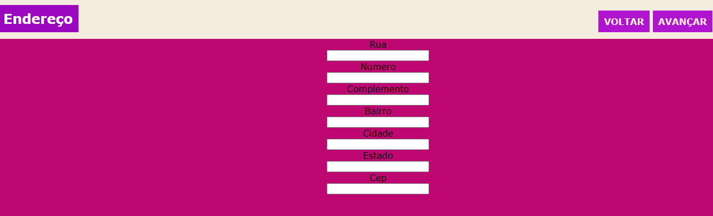
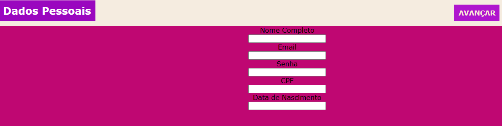

# Formulario - Ecommerce
 
Projeto foi desenvolvimento durante as aulas de Fundamentos de Desenvolvimento Web, ministradas pelo  professor [Leonardo Rocha](https://github.com/leonardossrocha). Esse projeto foi criado a partir da pesquisa feitas em 3 sites de e-commerce e em dois projetos: [formulário de contato](https://github.com/bbrendagomess/form-contato) e [formulário de login](https://github.com/bbrendagomess/projeito-longin)
 
## Índice
* [Descrição](#descrição)
* [Tecnologias](#tecnologias)
* [Referências](#referências)
* [Autor(a)](#autora)
 
## Descrição
 
Um projeto para criar uma página de login com linguagens de HTML e CSS.
 
 
## Tecnologias
 
* HTML5
* CSS3
* Git
* Github
 
## Códigos
 
* background-color - Propriedade CSS que define cor de fundo de um elemento.
 
 * font family - A propriedade font-family do CSS permite que se faça uma lista de prioridades de familias de fontes e/ou nomes genéricos de famílias a serem especificados para um elemento selecionado.
 
* display - A propriedade display CSS define se um elemento é tratado como um bloco ou elemento inline e o layout usado para seus filhos, como layout de fluxo, grid ou flex.
 
* height - A propriedade height do CSS determina a altura da área do conteúdo de um elemento. A área de conteúdo consiste no padding, margin e border do elemento.
 
* text-aling - A propriedade CSS text-align descreve como conteúdo inline, como texto, é alinhado no elemento pai em bloco. text-align não controla o alinhamento de elementos em bloco, apenas o seu conteúdo inline.

## Resultado do projeito

 
 
## Referências
 
* [Alura](https://www.alura.com.br/artigos/escrever-bom-readme) - Como escrever um README incrivel no seu gitHub
* [MDN](https://developer.mozilla.org/pt-BR/) - Usado para uma pesquisa aprofundada dos itens de CSS e HTML.
 
## Autor(a)
 
Projeto desenvolvido pelo aluna:
 
* Brenda peitl gomes.
 

 